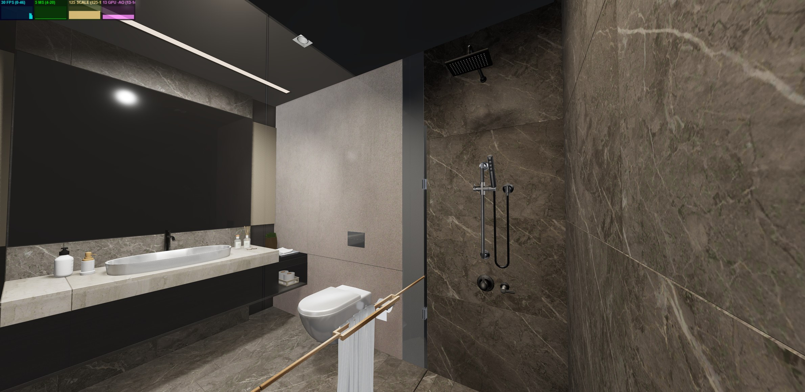
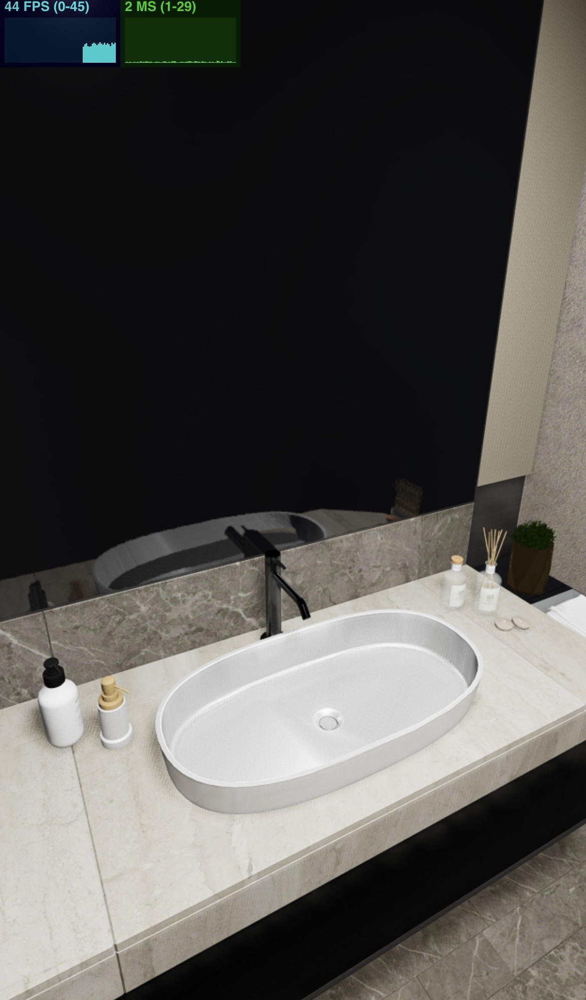
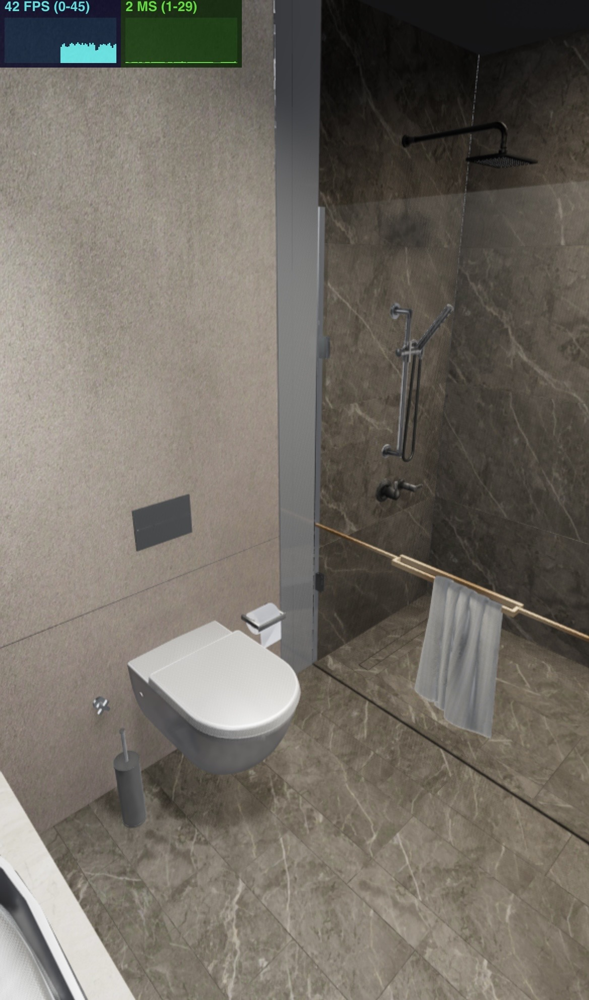

# Bathroom WebGPU

Сцена ванной комнаты на vanilla Three.js, TypeScript и `WebGPURenderer`. Основной акцент был на подготовке тяжёлой исходной модели, корректных PBR материалах, освещении и стабильной связке экранных эффектов.

## Ссылки

- Репозиторий: [github.com/PWRXNDR/bathroom](https://github.com/PWRXNDR/bathroom)
- Демо: [bathroom.dubralex.com](https://bathroom.dubralex.com)

## Кратко

- Vanilla Three.js r185, TypeScript и `WebGPURenderer`.
- Пайплайн: G-buffer → GTAO → beauty → SSR → SSGI → HDR composite → TAA → ACES.
- Исходная модель: 25.94 → 4.95 MiB, 2072 → 77 mesh nodes, текстуры в KTX2, геометрия в Draco.
- Более 60 FPS без ограничения на ноутбуке, 44–45 FPS на Galaxy S23 Ultra, 39–44 FPS на iPhone 13 с iOS 26.
- Adaptive quality: render scale 1.25–1.75 по измеренной частоте кадров.
- GPU profiling: timestamp queries через WebGPU, полный pipeline занимает в среднем 13.623 ms на RTX 5060 Laptop при фиксированном render scale 1.25.
- Не решено до конца: изоляция отражения зеркала от base material response.

Подробности по каждому пункту ниже.

## Запуск

Требуется Node.js 22.12 или новее.

```bash
npm install
npm run dev
```

Production сборка и локальная проверка:

```bash
npm run build
npm run preview
```

Сборка не использует WebGL fallback. Если браузер или GPU не поддерживает WebGPU, приложение показывает экран ошибки вместо запуска другой версии рендера.

## Соответствие заданию

| Требование | Статус | Реализация |
| --- | --- | --- |
| Three.js + TypeScript + WebGPU | Выполнено | Three.js r185, Vite, TypeScript, только `WebGPURenderer` |
| HDRI для IBL | Выполнено | HDR окружение загружается через `RGBELoader`, затем подготавливается через PMREM |
| Прямые источники света | Выполнено | Три настроенных `SpotLight` с мягкими тенями и один слабый ambient source |
| SSAO | Выполнено | GTAO из WebGPU TSL используется как более точный метод того же класса screen space ambient occlusion |
| SSR | Выполнено | Экранные отражения учитывают depth, normal, roughness, metalness и окружение |
| SSGI | Выполнено | Диффузный screen space bounce с temporal filtering |
| Tone Mapping | Выполнено | ACES, exposure 0.668 |
| Минимум 30 FPS | Выполнено с запасом | более 60 FPS без ограничения при зафиксированном render scale 1.25, финальная частота намеренно ограничена |
| Адаптивное качество | Выполнено | Runtime pixel ratio меняется от 1.25 до 1.75 по измеренной частоте кадров, idle cap исключён из оценки |
| GPU profiling | Выполнено | При поддержке `timestamp-query` WebGPU измеряет реальное GPU время render passes, результат показывается четвёртой панелью `stats.js` |
| Готовность к Vercel | Выполнено | Есть `vercel.json`, production команда и SPA rewrite |

## Архитектура

Структура специально оставлена небольшой:

- `App.ts` управляет загрузкой, жизненным циклом и частотой кадров.
- `Renderer.ts` инициализирует WebGPU, цветовое пространство, tone mapping, тени и GPU timestamp queries.
- `World.ts` собирает сцену, HDRI и источники света.
- `Bathroom.ts` загружает две оптимизированные GLB модели и нормализует материалы после конвертации.
- `PostProcessing.ts` содержит G-buffer и весь render pipeline.
- `UI.ts` содержит три постоянные панели `stats.js`: FPS, CPU frame time и render scale. Четвёртая панель с GPU milliseconds добавляется только при поддержке `timestamp-query`.
- `Preloader.ts` показывает круг загрузки без текста и дополнительного интерфейса.

## Render pipeline

Пайплайн собирается через Three.js `RenderPipeline` и TSL в следующем порядке:

1. Opaque G-buffer: normal, diffuse, metalness, roughness, dielectric response, clearcoat, depth и velocity.
2. GTAO: ambient occlusion из depth и normal, применяется только к ambient составляющей beauty pass.
3. Beauty pass: PBR освещение от HDRI и трёх spot lights с тенями.
4. SSR: отражения из текущего кадра с разной обработкой металлов, зеркала и rough dielectric поверхностей.
5. SSGI: короткий диффузный перенос света между близкими поверхностями.
6. HDR composite: beauty, SSR и SSGI объединяются в linear HDR, затем применяется saturation.
7. Reversible HDR compression: яркие значения сжимаются перед temporal pass.
8. TAA: стабилизирует шум и мерцание SSR и SSGI.
9. Sharpen и обратное восстановление HDR диапазона.
10. ACES tone mapping и sRGB output.

Bloom и DOF сознательно не добавлялись: задание их не требовало, bloom менял характер светильников и увеличивал время кадра, а DOF не подходил для свободной камеры интерьера.

## Почему выбран ACES

В проекте можно было использовать и ACES, и AgX, поэтому оба варианта сравнивались с референсом на одной сцене и с одинаковым освещением. AgX мягче обрабатывает яркие участки, но в данном интерьере он заметно поднимает тёмные значения. Из-за этого чёрные поверхности и тени выглядят более серыми и немного вымытыми.

ACES даёт более близкую к референсу глубину тёмных цветов, контраст в тенях и общий оттенок материалов. Светлые участки при этом обрабатываются агрессивнее, но для этой конкретной сцены результат оказался визуально ближе, поэтому ACES оставлен финальным вариантом.

<p align="center">
  
  <br>
  <sub>Референс</sub>
</p>

<table>
  <tr>
    <td align="center" width="50%">
      
      <br><sub>AgX: более мягкий, но тёмные участки выглядят более вымытыми</sub>
    </td>
    <td align="center" width="50%">
      
      <br><sub>ACES: цвет, контраст и глубина теней ближе к референсу</sub>
    </td>
  </tr>
</table>

## Что сработало

- HDRI даёт стабильную базу для керамики, хрома, стекла и остальных отражающих материалов. Прямые источники света отвечают за форму, локальные акценты и тени.
- GTAO хорошо подчёркивает стыки, пространство под тумбой и мелкие контакты, при этом не затемняет уже освещённые области целиком.
- SSR особенно заметен на зеркале, металле и глянцевой плитке. Для шероховатых неметаллических поверхностей отражение дополнительно смешивается с albedo, поэтому оно выглядит частью материала, а не отдельной глянцевой плёнкой.
- SSGI добавляет мягкий локальный перенос цвета между близкими поверхностями, например рядом с сантехникой и полотенцем.
- TAA оказался оправданным дополнением. Без temporal accumulation SSR и SSGI заметно шумели при движении камеры.
- GPU timestamp queries дают фактическую длительность работы GPU, а не только CPU время отправки команд. Профиль полного pipeline и варианты с отключёнными passes снимаются автоматически при одинаковой камере, разрешении и render scale.
- Камера свободно вращается, двигается и масштабируется через `OrbitControls`, стартовая позиция сразу находится внутри ванной.
- Adaptive quality автоматически снижает render scale при частоте ниже 38 FPS и постепенно возвращает качество при стабильных 43 FPS и выше. Это позволяет одной сборке адаптироваться к производительности конкретного устройства, не реагируя ошибочно на намеренный idle cap.
- Без искусственного ограничения сцена в проведённых тестах работала более чем на 60 FPS при зафиксированном render scale 1.25, то есть с framebuffer выше разрешения CSS viewport. В финальной сборке частота намеренно ограничена до 45 FPS во время взаимодействия и до 30 FPS после паузы. Это уменьшает энергопотребление и нагрев, а не маскирует нехватку производительности.

## Что не сработало и почему

### Fireflies и порядок TAA

Прямое применение финального ACES до TAA с последующим "обратным ACES" было бы математически неверным. ACES включает нелинейное преобразование и clipping, поэтому точно восстановить исходный HDR сигнал после него невозможно.

Вместо этого перед TAA используется обратимое сжатие по максимальному RGB каналу. Оно ограничивает слишком яркие выбросы, TAA работает с безопасным диапазоном, после чего HDR восстанавливается и только затем проходит через финальный ACES. Дополнительный peak guard не даёт знаменателю приблизиться к нулю. Это убрало большую часть fireflies без заметного изменения цвета сцены.

### Зеркало

В зеркале остался конфликт материала с общей связкой SSR, IBL и постпроцессинга. Параметры, которые дают подходящий цвет и яркость поверхности, одновременно влияют на отражающий вклад, поэтому отражение может выглядеть темнее или более мутным, чем в референсе. Настоящее planar reflection требует второго рендера сцены с отражённой камерой. Такой вариант тестировался, но дал слишком высокую нагрузку и более сложное поведение при свободной камере.

В финале зеркало остаётся PBR материалом без albedo и normal текстур, а отражение формируется SSR и IBL. Это быстрее, но не позволяет полностью изолировать отражение от остальных параметров материала, а объекты за пределами экрана не могут появиться в отражении. Если бы времени было больше, я бы отдельно исследовал этот конфликт и вынес зеркало в собственную маску или слой композита, чтобы настраивать отражение независимо от base material response.

### Шум и temporal artifacts

SSR и SSGI работают только с данными текущего экрана. На краях, при disocclusion и быстром движении камеры информации не хватает. TAA уменьшает шум, но может оставить короткий ghost trail. Полностью убрать этот конфликт без более дорогого history rejection и denoiser не получилось.

### Некорректные материалы после экспорта

Часть импортированных материалов содержала экстремальный IOR, неудачные значения roughness и metalness, лишние текстуры или неверную интерпретацию normal map. Из-за этого поверхности становились чёрными, слишком матовыми или пересвеченными. Материалы нормализуются при загрузке, а для визуально важных объектов применяются точечные overrides.

## Оптимизация модели

Подготовка ассетов заняла больше всего времени. Основная проблема была не только в количестве треугольников, но и в тысячах отдельных узлов, повторяющихся картинках, лишних material slots и несовпадающих данных после Blender и glTF конвертации.

| Метрика | Исходная ванная | Runtime ванная |
| --- | ---: | ---: |
| Размер GLB | 25.94 MiB | 4.95 MiB |
| Mesh nodes | 2072 | 77 |
| Mesh definitions | 2069 | 77 |
| Треугольники | 352 583 | 340 149 |
| `POSITION` элементы | 444 431 | 471 233 |
| Материалы | 78 | 77 |
| Текстуры | 54 | 48 KTX2 |
| Дубликаты изображений | 5 групп | 0 |

Отдельное полотенце уменьшено с 1.47 MiB до 0.24 MiB и содержит 60 476 треугольников. Значение 340 149 в таблице относится только к основной модели ванной. Вместе с отдельным полотенцем вся runtime сцена содержит 400 625 треугольников, 78 mesh nodes и 49 KTX2 текстур.

Геометрия сжата Draco, изображения переведены в KTX2 через Khronos KTX-Software. KTX2 уменьшает загрузку и объём данных в GPU памяти, Draco уменьшает сетевой размер геометрии. Повторяющиеся mesh nodes основной комнаты объединены по материалу, полотенце оставлено отдельным ассетом с исходным transform.

Количество `POSITION` элементов после оптимизации может быть немного больше Blender vertex count. Это ожидаемо: glTF разделяет вершины на UV seams, hard normals, tangents и границах material groups. Такое число нельзя напрямую сравнивать с количеством сваренных вершин в Blender. В данном случае основной выигрыш пришёл от уменьшения draw calls и веса ассетов, а не от агрессивного разрушения силуэта.

## Производительность

Основное тестирование выполнялось на следующем устройстве:

- Lenovo LOQ
- AMD Ryzen 7 250 with Radeon 780M Graphics, 8 ядер и 16 потоков
- NVIDIA GeForce RTX 5060 Laptop GPU
- 32 GB RAM
- Windows 11 Home
- Google Chrome 150.0.7871.129
- Render scale зафиксирован на 1.25 для uncapped замера

Наблюдаемый результат в production сборке:

- более 60 FPS без ограничения частоты при зафиксированном render scale 1.25
- 45 FPS во время навигации камеры после включения финального cap
- 30 FPS после перехода в idle режим, также из-за намеренного cap
- примерно 4–8 ms CPU frame time по панели `stats.js`

### GPU timestamp profiling

`WebGPURenderer` запускается с `trackTimestamp: true`. Если адаптер поддерживает feature `timestamp-query`, WebGPU backend создаёт `GPUQuerySet` типа `timestamp`, записывает начало и конец render passes, выполняет `resolveQuerySet` в GPU buffer и после асинхронного readback переводит наносекунды в миллисекунды. В сцене результат отображается отдельной панелью `GPU MS`. Если feature недоступна, приложение продолжает работать без этой панели.

Для воспроизводимого сравнения добавлен профильный режим. Он фиксирует render scale на 1.25, отключает adaptive quality, сохраняет ту же камеру, свет, ассеты и framebuffer размер 1920 × 1080 CSS pixels. Скрипт делает 12 timestamp samples для каждой конфигурации и сохраняет исходные значения в [`docs/gpu-profile-results.json`](docs/gpu-profile-results.json):

```bash
# В первом терминале
npm run dev -- --host 127.0.0.1

# Во втором терминале
npm run profile:gpu
```

Замер выполнен 24 июля 2026 года в Chrome 150 на NVIDIA GeForce RTX 5060 Laptop GPU. Это GPU время всего активного render graph для кадра, а не изолированный synthetic benchmark одного shader:

| Конфигурация | Среднее GPU время | Диапазон | Разница с full |
| --- | ---: | ---: | ---: |
| Full: G-buffer + GTAO + beauty + SSR + SSGI + TAA | 13.623 ms | 13.540–13.723 ms | — |
| Без GTAO | 13.254 ms | 12.947–13.810 ms | −0.369 ms |
| Без SSR | 7.343 ms | 7.222–7.759 ms | −6.280 ms |
| Без SSGI | 10.679 ms | 10.455–10.828 ms | −2.944 ms |
| Base: G-buffer + GTAO + beauty + TAA | 4.127 ms | 4.038–4.287 ms | −9.496 ms |

13.623 ms полного graph соответствует примерно 73.4 кадра GPU работы в секунду, но это не обещание итоговых 73.4 FPS: CPU submission, browser compositor, дисплей и намеренный runtime cap учитываются отдельно. Дельты показывают, что в этой сцене самым дорогим экранным эффектом является SSR, затем SSGI, а GTAO занимает относительно небольшую часть бюджета. Значения нельзя складывать как полностью независимые costs: TSL удаляет неиспользуемые ветки graph, passes используют общие входные textures, а нагрузка GPU нелинейна. Поэтому таблица показывает честные A/B конфигурации, а не заявляет точную изоляцию каждого shader.

<table>
  <tr>
    <td align="center" width="50%">
      
      <br><sub>Full pipeline, среднее 13.623 ms GPU</sub>
    </td>
    <td align="center" width="50%">
      
      <br><sub>Без GTAO, среднее 13.254 ms GPU</sub>
    </td>
  </tr>
  <tr>
    <td align="center" width="50%">
      
      <br><sub>Без SSR, среднее 7.343 ms GPU</sub>
    </td>
    <td align="center" width="50%">
      
      <br><sub>Без SSGI, среднее 10.679 ms GPU</sub>
    </td>
  </tr>
</table>

<p align="center">
  
  <br><sub>Base без SSR и SSGI, среднее 4.127 ms GPU</sub>
</p>

RTX 5060 Laptop является достаточно мощной дискретной видеокартой. Этот результат показывает запас на high-end ноутбуке, но сам по себе не является доказательством такой же производительности на iPad-class устройствах.

Для более чёткой картинки на high-DPI экранах runtime render scale адаптивно меняется от 1.25 до 1.75. В этом проекте render scale является итоговым значением `WebGPURenderer.setPixelRatio`, а не множителем поверх системного `devicePixelRatio`. Поэтому на телефоне при scale 1.25 framebuffer имеет размер CSS viewport × 1.25, даже если DPR самого экрана равен 3 или больше. Во время взаимодействия scale уменьшается, если измеренная частота опускается ниже 38 FPS, и постепенно восстанавливается при стабильных 43 FPS и выше. Намеренный idle cap 30 FPS в эту оценку не входит, поэтому пауза пользователя не снижает качество сцены.

Дополнительно production версия была проверена на Samsung Galaxy S23 Ultra в Google Chrome с включённым adaptive quality. Во время приложенных замеров render scale находился на нижней границе 1.25, а мгновенное значение `stats.js` составляло 44–45 FPS. Adaptive quality принимает решение по среднему значению за окно 1.5 секунды и повышает scale только на 0.05 за один шаг, поэтому короткий выход к лимиту 45 FPS ещё не успевает поднять его выше нижней границы. На кадрах также видно примерно 7–10 ms CPU frame time без заметных провалов при движении камеры. Это уже проверка на реальном мобильном устройстве, хотя Galaxy S23 Ultra относится к производительным флагманам и не заменяет полноценную матрицу iPad-class и более слабых мобильных GPU.

<p align="center">
  
  
</p>

Также production сборка с включённым adaptive quality была протестирована на iPhone 13 с iOS 26 в Safari и Google Chrome. Оба браузера на iOS используют WebKit, поэтому это проверка двух browser shells поверх одной реализации WebGPU, а не двух независимых движков. Во время навигации наблюдалось примерно 39–44 FPS, поэтому сцена оставалась выше обязательной отметки 30 FPS и на более старом мобильном устройстве. На двух приложенных кадрах зафиксированы 42 и 44 FPS при CPU frame time около 2–4 ms. Это хороший практический результат, но он всё равно не заменяет полноценное тестирование на нескольких версиях iOS и устройствах с разным тепловым режимом.

<p align="center">
  
  
</p>

## Ограничения WebGPU и Three.js

- WebGPU требует современный браузер, подходящий GPU driver и secure context. Поддержка всё ещё менее универсальна, чем WebGL2.
- TSL и WebGPU postprocessing API в Three.js развиваются быстро. Некоторые node interfaces меняются между релизами, поэтому версия Three.js зафиксирована.
- У WebGPU pipeline нет прямой совместимости со старым WebGL `EffectComposer`. Passes и attachments пришлось собирать явно.
- SSAO, SSR и SSGI экранные по своей природе. Они не видят закрытую или находящуюся за пределами кадра геометрию.
- Прозрачное стекло не участвует в opaque G-buffer так же, как обычная поверхность. Это ограничивает вклад стекла в screen space GI и reflections.
- WebGPU fallback на WebGL2 потребовал бы отдельной реализации части TSL passes и другого postprocessing graph. Простого переключения renderer здесь недостаточно.
- GPU timestamps доступны не во всех браузерах и backend конфигурациях. Поэтому GPU панель включается условно, а стабильные FPS, CPU frame time и render scale панели остаются доступными независимо от этой feature.

## Что я бы сделал дальше

Если бы времени было больше, следующие шаги дали бы наибольшую пользу:

1. Добавить более строгий temporal history rejection и spatial denoiser для SSGI и SSR.
2. Сделать LOD для полотенца и нескольких мелких круглых деталей, где всё ещё много геометрии.
3. Расширить уже добавленный GPU timestamp profiling отдельными markers вокруг каждого compute/render pass и сравнить результаты в Windows/Chrome, Android/Chrome и iPad/Safari.
4. Перевести управление passes в небольшой render graph с переиспользованием transient attachments.
5. Проверить adaptive quality на iPad/Safari и более слабых мобильных GPU, затем оформить проверенные пороги в отдельный облегчённый quality preset.
6. Изолировать отражение зеркала от base material response через отдельную маску или слой композита. Для high-end профиля также проверить выборочный planar mirror или локальный reflection probe.
7. Провести ещё один материал и light matching pass по фиксированным reference cameras, желательно с автоматическим image diff.

## Источники ассетов

- Bathroom Interior, Oguz Kaya, Sketchfab, лицензия CC BY.
- Studio Small 08, Sergej Majboroda, Poly Haven, лицензия CC0.
