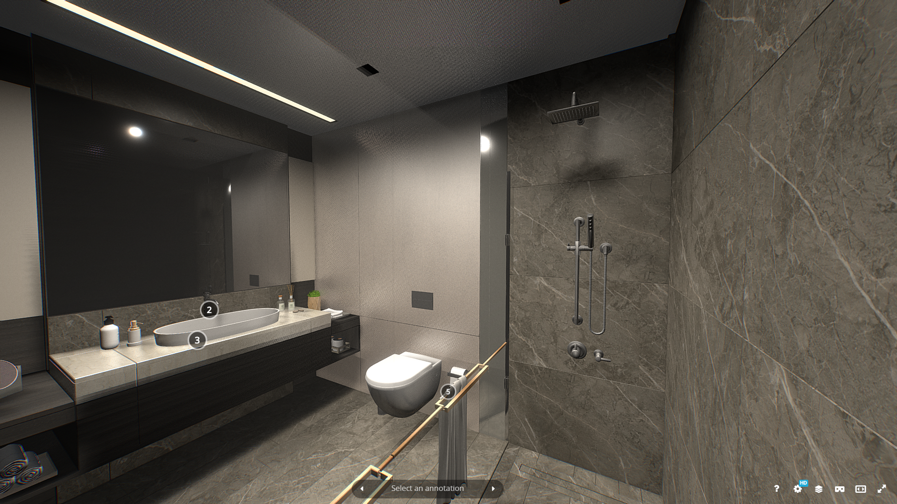
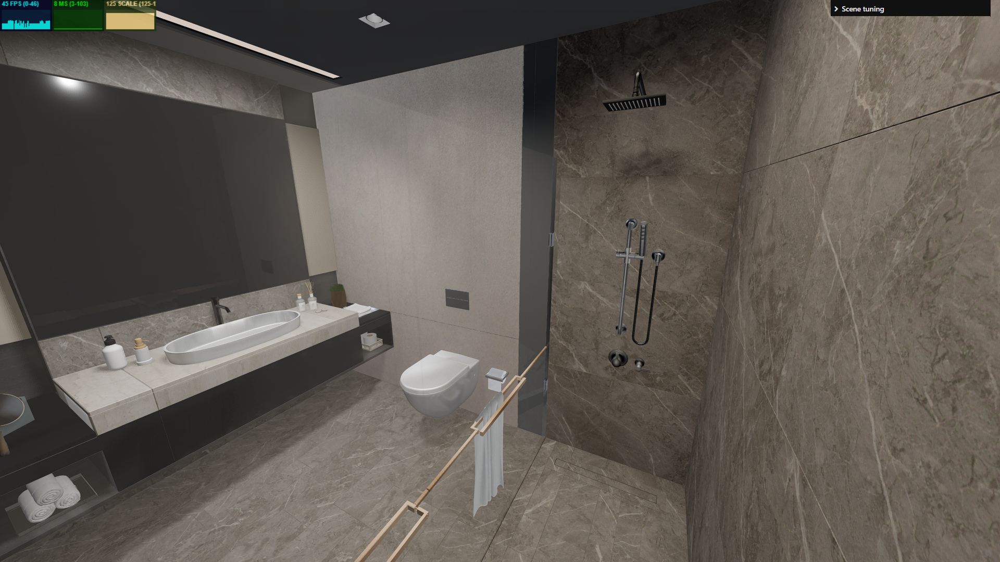
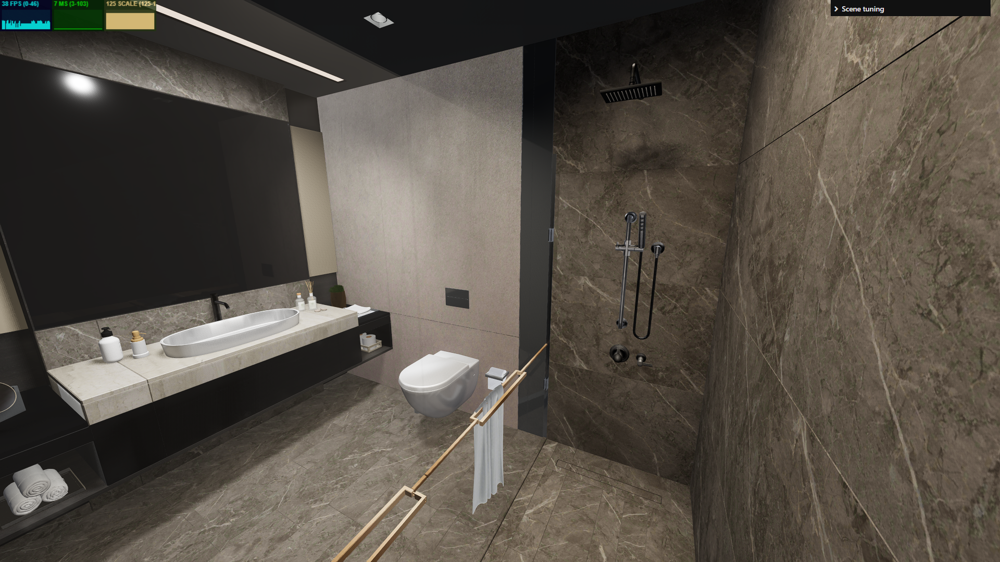
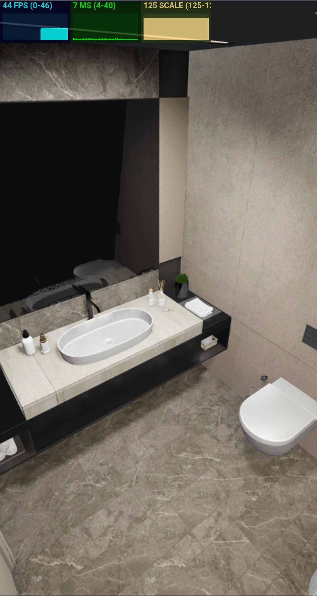
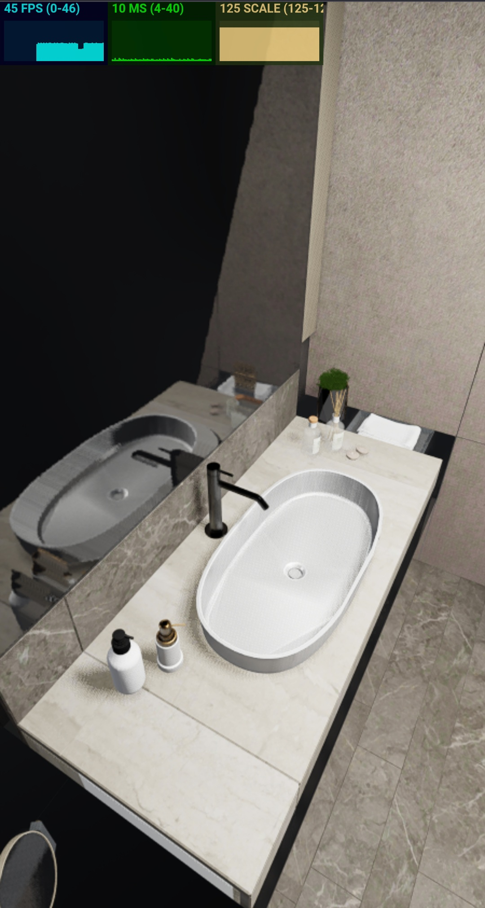

# Bathroom WebGPU

Cцена ванной комнаты на vanilla Three.js, TypeScript и `WebGPURenderer`. Основной акцент был на подготовке тяжёлой исходной модели, корректных PBR материалах, освещении и стабильной связке экранных эффектов.

## Ссылки

- Репозиторий: [github.com/PWRXNDR/bathroom](https://github.com/PWRXNDR/bathroom)
- Демо: [bathroom.dubralex.com](https://bathroom.dubralex.com)

## Запуск

Требуется Node.js 22.12 или новее.

```bash
npm install
npm run dev
```

Production сборка и локальная проверка:

```bash
npm run build
npm run preview
```

Сборка не использует WebGL fallback. Если браузер или GPU не поддерживает WebGPU, приложение показывает экран ошибки вместо запуска другой версии рендера.

## Соответствие заданию

| Требование | Статус | Реализация |
| --- | --- | --- |
| Three.js + TypeScript + WebGPU | Выполнено | Three.js r185, Vite, TypeScript, только `WebGPURenderer` |
| HDRI для IBL | Выполнено | HDR окружение загружается через `RGBELoader`, затем подготавливается через PMREM |
| Прямые источники света | Выполнено | Три настроенных `SpotLight` с мягкими тенями и один слабый ambient source |
| SSAO | Выполнено | GTAO из WebGPU TSL используется как реализация screen space ambient occlusion |
| SSR | Выполнено | Экранные отражения учитывают depth, normal, roughness, metalness и окружение |
| SSGI | Выполнено | Диффузный screen space bounce с temporal filtering |
| Tone Mapping | Выполнено | ACES, exposure 0.668 |
| Минимум 30 FPS | Выполнено с запасом | болee 60 FPS без ограничения при render scale 1.25, финальная частота намеренно ограничена |
| Готовность к Vercel | Выполнено | Есть `vercel.json`, production команда и SPA rewrite |

## Архитектура

Структура специально оставлена небольшой:

- `App.ts` управляет загрузкой, жизненным циклом и частотой кадров.
- `Renderer.ts` инициализирует WebGPU, цветовое пространство, tone mapping и тени.
- `World.ts` собирает сцену, HDRI и источники света.
- `Bathroom.ts` загружает две оптимизированные GLB модели и чинит материалы после конвертации.
- `PostProcessing.ts` содержит G-buffer и весь render pipeline.
- `UI.ts` оставляет только три панели `stats.js`: FPS, CPU frame time и render scale.
- `Preloader.ts` показывает круг загрузки без текста и дополнительного интерфейса.

## Render pipeline

Пайплайн собирается через Three.js `RenderPipeline` и TSL в следующем порядке:

1. Opaque G-buffer: normal, diffuse, metalness, roughness, dielectric response, clearcoat, depth и velocity.
2. GTAO: ambient occlusion из depth и normal, применяется только к ambient составляющей beauty pass.
3. Beauty pass: PBR освещение от HDRI и трёх spot lights с тенями.
4. SSR: отражения из текущего кадра с разной обработкой металлов, зеркала и rough dielectric поверхностей.
5. SSGI: короткий диффузный перенос света между близкими поверхностями.
6. HDR composite: beauty, SSR и SSGI объединяются в linear HDR, затем применяется saturation.
7. Reversible HDR compression: яркие значения сжимаются перед temporal pass.
8. TAA: стабилизирует шум и мерцание SSR и SSGI.
9. Sharpen и обратное восстановление HDR диапазона.
10. ACES tone mapping и sRGB output.

## Почему выбран ACES

В проекте можно было использовать и ACES, и AgX, поэтому оба варианта сравнивались с референсом на одной сцене и с одинаковым освещением. AgX мягче обрабатывает яркие участки, но в данном интерьере он заметно поднимает тёмные значения. Из-за этого чёрные поверхности и тени выглядят более серыми и немного вымытыми.

ACES даёт более близкую к референсу глубину тёмных цветов, контраст в тенях и общий оттенок материалов. Светлые участки при этом обрабатываются агрессивнее, но для этой конкретной сцены результат оказался визуально ближе, поэтому ACES оставлен финальным вариантом.

<p align="center">
  
  <br>
  <sub>Референс</sub>
</p>

<table>
  <tr>
    <td align="center" width="50%">
      
      <br><sub>AgX: более мягкий, но тёмные участки выглядят более вымытыми</sub>
    </td>
    <td align="center" width="50%">
      
      <br><sub>ACES: цвет, контраст и глубина теней ближе к референсу</sub>
    </td>
  </tr>
</table>

## Что сработало

- HDRI даёт стабильную базу для керамики, хрома, стекла и остальных отражающих материалов. Прямые источники света отвечают за форму, локальные акценты и тени.
- GTAO хорошо подчёркивает стыки, пространство под тумбой и мелкие контакты, при этом не затемняет уже освещённые области целиком.
- SSR особенно заметен на зеркале, металле и глянцевой плитке. Для шероховатых неметаллических поверхностей отражение дополнительно смешивается с albedo, поэтому оно выглядит частью материала, а не отдельной глянцевой плёнкой.
- SSGI добавляет мягкий локальный перенос цвета между близкими поверхностями, например рядом с сантехникой и полотенцем.
- TAA оказался оправданным дополнением. Без temporal accumulation SSR и SSGI заметно шумели при движении камеры.
- Камера свободно вращается, двигается и масштабируется через `OrbitControls`, стартовая позиция сразу находится внутри ванной.
- Без искусственного ограничения сцена в проведённых тестах работала примерно на 60 FPS при render scale 1.25, то есть с supersampling выше нативного разрешения. В финальной сборке частота намеренно ограничена до 45 FPS во время взаимодействия и до 30 FPS после паузы. Это уменьшает энергопотребление и нагрев, а не маскирует нехватку производительности.

## Что не сработало и почему

### Fireflies и порядок TAA

Прямое применение финального ACES до TAA с последующим "обратным ACES" было бы математически неверным. ACES включает нелинейное преобразование и clipping, поэтому точно восстановить исходный HDR сигнал после него невозможно.

Вместо этого перед TAA используется обратимое сжатие по максимальному RGB каналу. Оно ограничивает слишком яркие выбросы, TAA работает с безопасным диапазоном, после чего HDR восстанавливается и только затем проходит через финальный ACES. Дополнительный peak guard не даёт знаменателю приблизиться к нулю. Это убрало большую часть fireflies без заметного изменения цвета сцены.

### Зеркало

В зеркале остался конфликт материала с общей связкой SSR, IBL и постпроцессинга. Параметры, которые дают подходящий цвет и яркость поверхности, одновременно влияют на отражающий вклад, поэтому отражение может выглядеть темнее или более мутным, чем в референсе. Настоящее planar reflection требует второго рендера сцены с отражённой камерой. Такой вариант тестировался, но дал слишком высокую нагрузку и более сложное поведение при свободной камере.

В финале зеркало остаётся PBR материалом без albedo и normal текстур, а отражение формируется SSR и IBL. Это быстрее, но не позволяет полностью изолировать отражение от остальных параметров материала, а объекты за пределами экрана не могут появиться в отражении. Если бы времени было больше, я бы отдельно исследовал этот конфликт и вынес зеркало в собственную маску или слой композита, чтобы настраивать отражение независимо от base material response.

### Шум и temporal artifacts

SSR и SSGI работают только с данными текущего экрана. На краях, при disocclusion и быстром движении камеры информации не хватает. TAA уменьшает шум, но может оставить короткий ghost trail. Полностью убрать этот конфликт без более дорогого history rejection и denoiser не получилось.

### Некорректные материалы после экспорта

Часть импортированных материалов содержала экстремальный IOR, неудачные значения roughness и metalness, лишние текстуры или неверную интерпретацию normal map. Из-за этого поверхности становились чёрными, слишком матовыми или пересвеченными. Материалы нормализуются при загрузке, а для визуально важных объектов применяются точечные overrides.

## Оптимизация модели

Подготовка ассетов заняла больше всего времени. Основная проблема была не только в количестве треугольников, но и в тысячах отдельных узлов, повторяющихся картинках, лишних material slots и несовпадающих данных после Blender и glTF конвертации.

| Метрика | Исходная ванная | Runtime ванная |
| --- | ---: | ---: |
| Размер GLB | 25.94 MiB | 4.95 MiB |
| Mesh nodes | 2072 | 77 |
| Mesh definitions | 2069 | 77 |
| Треугольники | 352 583 | 340 149 |
| `POSITION` элементы | 444 431 | 471 233 |
| Материалы | 78 | 77 |
| Текстуры | 54 | 48 KTX2 |
| Дубликаты изображений | 5 групп | 0 |

Отдельное полотенце уменьшено с 1.47 MiB до 0.24 MiB и содержит 60 476 треугольников. Значение 340 149 в таблице относится только к основной модели ванной. Вместе с отдельным полотенцем вся runtime сцена содержит 400 625 треугольников, 78 mesh nodes и 49 KTX2 текстур.

Геометрия сжата Draco, изображения переведены в KTX2 через Khronos KTX-Software. KTX2 уменьшает загрузку и объём данных в GPU памяти, Draco уменьшает сетевой размер геометрии. Повторяющиеся mesh nodes основной комнаты объединены по материалу, полотенце оставлено отдельным ассетом с исходным transform.

Количество `POSITION` элементов после оптимизации может быть немного больше Blender vertex count. Это ожидаемо: glTF разделяет вершины на UV seams, hard normals, tangents и границах material groups. Такое число нельзя напрямую сравнивать с количеством сваренных вершин в Blender. В данном случае основной выигрыш пришёл от уменьшения draw calls и веса ассетов, а не от агрессивного разрушения силуэта.

## Производительность

Тестирование выполнялось на следующем устройстве:

- Lenovo LOQ
- AMD Ryzen 7 250 with Radeon 780M Graphics, 8 ядер и 16 потоков
- NVIDIA GeForce RTX 5060 Laptop GPU
- 32 GB RAM
- Windows 11 Home
- Google Chrome 150.0.7871.129
- Render scale 1.25

Наблюдаемый результат в production сборке:

- болee 60 FPS без ограничения частоты при render scale 1.25
- 45 FPS во время навигации камеры после включения финального cap
- 30 FPS после перехода в idle режим, также из-за намеренного cap
- примерно 4–8 ms CPU frame time по панели `stats.js`

RTX 5060 Laptop является достаточно мощной дискретной видеокартой. Этот результат показывает запас на high-end ноутбуке, но сам по себе не является доказательством такой же производительности на iPad-class устройствах.

Дополнительно production версия была проверена на Samsung Galaxy S23 Ultra в Google Chrome при render scale 1.25. Во время навигации сцена держала 44–45 FPS, то есть практически постоянно доходила до намеренно установленного лимита 45 FPS. На приложенных кадрах `stats.js` показывает примерно 7–10 ms CPU frame time без заметных провалов при движении камеры. Это уже проверка на реальном мобильном устройстве, хотя Galaxy S23 Ultra относится к производительным флагманам и не заменяет полноценную матрицу iPad-class и более слабых мобильных GPU.

Для более чёткой картинки на high-DPI экранах runtime render scale адаптивно меняется от 1.25 до 1.75. Во время взаимодействия он уменьшается, если измеренная частота опускается ниже 38 FPS, и постепенно восстанавливается при стабильных 43 FPS и выше. Намеренный idle cap 30 FPS в эту оценку не входит, поэтому пауза пользователя не снижает качество сцены.

<p align="center">
  
  
</p>

## Ограничения WebGPU и Three.js

- WebGPU требует современный браузер, подходящий GPU driver и secure context. Поддержка всё ещё менее универсальна, чем WebGL2.
- TSL и WebGPU postprocessing API в Three.js развиваются быстро. Некоторые node interfaces меняются между релизами, поэтому версия Three.js зафиксирована.
- У WebGPU pipeline нет прямой совместимости со старым WebGL `EffectComposer`. Passes и attachments пришлось собирать явно.
- SSAO, SSR и SSGI экранные по своей природе. Они не видят закрытую или находящуюся за пределами кадра геометрию.
- Прозрачное стекло не участвует в opaque G-buffer так же, как обычная поверхность. Это ограничивает вклад стекла в screen space GI и reflections.
- WebGPU fallback на WebGL2 потребовал бы отдельной реализации части TSL passes и другого postprocessing graph. Простого переключения renderer здесь недостаточно.
- GPU timestamps доступны не во всех браузерах и backend конфигурациях, поэтому в финальном интерфейсе оставлен стабильный CPU счётчик `stats.js`.

## Что я бы сделал дальше

Если бы времени было больше, следующие шаги дали бы наибольшую пользу:

1. Добавить более строгий temporal history rejection и spatial denoiser для SSGI и SSR.
2. Сделать LOD для полотенца и нескольких мелких круглых деталей, где всё ещё много геометрии.
3. Добавить GPU timestamp profiling и собрать таблицу на дискретной и интегрированной видеокарте.
4. Перевести управление passes в небольшой render graph с переиспользованием transient attachments.
5. Подготовить отдельный облегчённый quality preset для мобильных и интегрированных GPU.
6. Изолировать отражение зеркала от base material response через отдельную маску или слой композита. Для high-end профиля также проверить выборочный planar mirror или локальный reflection probe.
7. Провести ещё один материал и light matching pass по фиксированным reference cameras, желательно с автоматическим image diff.

## Источники ассетов

- Bathroom Interior, Oguz Kaya, Sketchfab, лицензия CC BY.
- Studio Small 08, Sergej Majboroda, Poly Haven, лицензия CC0.
